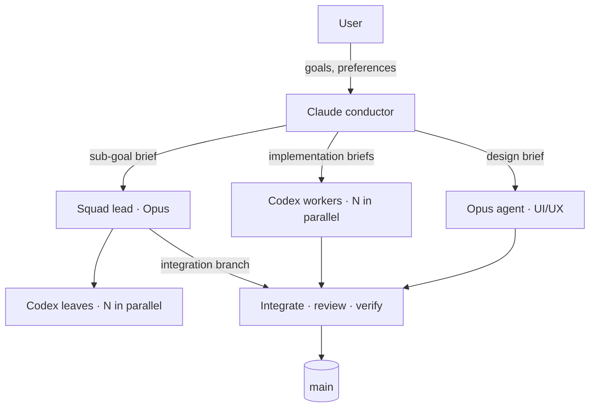
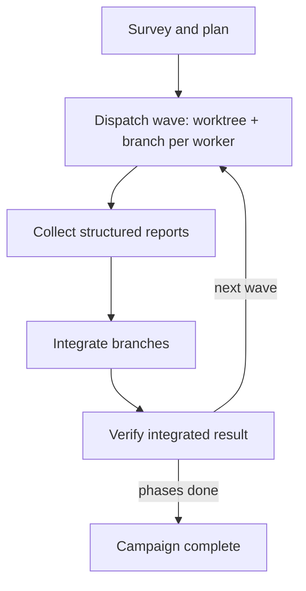

<p align="center">
  
</p>

# A Fable of Codexes

[](https://github.com/jvogan/a-fable-of-codexes/actions/workflows/validate.yml)
[](https://agentskills.io/specification)
[](LICENSE)

Claude Code skills that make Claude (Fable) the conductor of an AI worker
fleet. The conductor surveys and plans, dispatches many parallel OpenAI Codex
CLI workers for implementation and Claude Opus agents for design judgment,
then integrates, reviews, and verifies what comes back.

## Skills

### [campaign-conductor](skills/campaign-conductor/SKILL.md)

Runs a project as an orchestrated campaign.

- **Bootstrap.** First use in a repo creates `docs/campaign-hq/`
  (`CAMPAIGN.md` with the plan and fleet table, `LEARNINGS.md` with distilled
  lessons, `preferences.md` with worker routing) and adds a pointer to the
  project's CLAUDE.md. Every later session auto-discovers the campaign from
  the repo; the skill loads once per project.
- **Routing.** Opus for UI/UX and design judgment; Codex workers for
  implementation, tests, and research; native subagents for quick searches.
  Every worker defaults to the strongest configured model and reasoning;
  downshifts happen only on user preference. Stated preferences are written
  to `preferences.md` and persist across sessions.
- **Campaign sizing.** Small projects get a directly written plan. Large or
  unfamiliar ones get a parallel survey fan-out that drafts the plan for
  sign-off first.
- **Parallel fleets.** One writer per tree: git worktree and branch per
  worker, a fleet table tracking every dispatch with its session id,
  integration handled as its own dispatched task, and big campaigns
  structured as waves: dispatch, collect, integrate, verify. Finished Codex
  sessions resume with context intact for incremental corrections.
- **Squads.** For cohesive sub-goals, a Claude squad lead dispatches its own
  Codex workers, integrates, verifies, and returns one branch, with a hard
  depth cap, an exclusive branch namespace, and per-leaf evidence required
  in its report.
- **Review gates.** Fixed-schema worker reports, cross-model review (Claude
  reviews Codex diffs and Codex reviews Claude's), and same-brief bake-offs
  judged on artifacts for high-stakes tasks.
- **Worker capabilities.** Doctrine covers Codex web search for research
  scouts, image input for UI fixes from screenshots, native image generation
  for assets, and review mode.
- **Permissions.** The worker power envelope is set once at kickoff and
  recorded (Codex sandbox level, network access, Claude permission mode), so
  no wave stalls on a mid-run prompt.
- **Compounding memory.** Every dispatch outcome and user correction is
  logged, then compacted into standing rules so the files stay cheap to read
  at session start.

[`examples/campaign-hq/`](examples/campaign-hq/) shows the state files
mid-campaign, including a worked worker brief and the report schema.

### The fleet



Campaign state lives in the project, so any later session resumes it:

```
docs/campaign-hq/
├── CAMPAIGN.md      plan, phases, fleet table
├── LEARNINGS.md     standing rules + dispatch log
├── preferences.md   worker routing, permission envelope
├── briefs/          one file per dispatch
└── schemas/         worker-result.json
```

### How a campaign runs



## Install

```bash
npx skills add jvogan/a-fable-of-codexes --skill campaign-conductor
```

or manually:

```bash
git clone --depth 1 https://github.com/jvogan/a-fable-of-codexes.git /tmp/afoc
cp -r /tmp/afoc/skills/campaign-conductor ~/.claude/skills/
```

## Use

Install the skill, then say in any project:

> start a campaign

Claude bootstraps `docs/campaign-hq/`, sizes the plan to the project, and
begins dispatching workers. From then on, every session in that repo picks up
the campaign automatically. Direct it in plain language:

- "add a phase for the billing migration"
- "use sonnet for tests from now on" (persists in `preferences.md`)
- "status" (reads the plan and fleet table)

## Requirements

- **Claude Code.** The skill uses the Agent and Workflow tools.
- **OpenAI Codex CLI** ([github.com/openai/codex](https://github.com/openai/codex)).
  Install with `npm install -g @openai/codex` (or `brew install codex`), then
  run `codex login` with a ChatGPT account. Subscription auth gives flat-rate
  workers, which makes wide fan-out economical. Set the worker model and
  reasoning effort in `~/.codex/config.toml`:

  ```toml
  model = "gpt-5.5"
  model_reasoning_effort = "xhigh"
  ```

  Without Codex installed, the skill routes all work to Claude agents.
- **Codex plugin for Claude Code** (optional,
  [github.com/openai/codex-plugin-cc](https://github.com/openai/codex-plugin-cc)).
  Adds `/codex:review`, `/codex:adversarial-review`, and background-delegation
  slash commands for single interactive tasks. Install inside Claude Code:

  ```
  /plugin marketplace add openai/codex-plugin-cc
  /plugin install codex@openai-codex
  ```

## Validation

```bash
python3 scripts/validate.py
```

Checks every skill against the
[Agent Skills spec](https://agentskills.io/specification): frontmatter
fields, name format, and description length, plus this repo's 500-line body
limit and relative-link integrity. CI runs the same script on every push and
pull request.

## License

MIT
